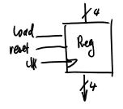
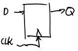

- toc
{:toc}

Sequential logics are digital logic that contains memory, or states. The output depends on the input as well as whatever state a system may hold.

Flip flops (FF) or registers are a common type of sequential logic blocks. Here is an example of a 4-bit register with `load` and `reset` signals:



Here is an example of a *positive D-Flip-Flop*. The FF holds the output and only changes to the input `D` when the input clock signal `clk` transitions on a positive edge (from low &rarr; high).



Implemenation in Verilog:

```verilog
module DFF(input D, input CLK, output Q);
    always @(posedge CLK)
        Q <= D;
endmodule
```

Note that it may be ambiguous to differentiate between combinational logic vs. sequential logic when using `always` blocks. So to be safe, in SystemVerilog we use `always_ff` to explicitly indicate the logic we are writing is sequential logic.

```verilog
module DFF(input D, input CLK, output Q);
    always_ff @(posedge CLK)
        Q <= D;
endmodule
```

## Blocking & Non-Blocking

### Blocking Assignment

```verilog
X = Y;
```

**Blocking** assignments describes assignment that are immediate. Any subsequent reference to `X` uses the "new" values (value of `Y`).

### Non-Blocking Assignment

```verilog
X <= Y;
```

**Non-blocking** assignments describe assignments that are not immediate and happen at the end of the clock cycle. Thus, any subsequent reference to the "old" value before the update.

Ordering of assignment *does not matter* when using non-blocking assignments.