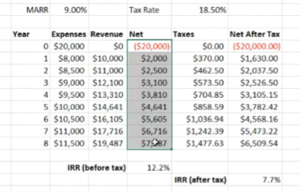

# Conference 8

```
someone please fill this gap in
```


## Assignment 3

**About the 5-15% catching rate**

> That means for each period we want to estimate period, the chance is undetermined. One can assume it's a uniform distribution between 5% to 15%.
> Assuming uniform distribution, it would average out to 10%. But then it will lower the standard deviation (spread) and give the illusion of less risk


## Midterm 2

- Expect expert understanding from stuff from midterm 1
- Take-home
- No collaboration
- There will be straight forward calculation questions
- But there will also be more discussion questions to gauge that we can explain concepts
  - i.e. explain why do falling interest rate favors investors
- Midterm will cover up to **taxes**
- Some review practice problems will be posted, but we will not go through them


## Taxes (Preview)

- "They screw us over"
- Taxes take a portion from our income, which reduces one's disposable income
- From business perspective, it's the same thing:
  - Taxes reduce profits
  - Essentially another *expense*
  - What if the government tax is 90-100%? How would that affect the decision?


**Example:**



- Note that businesses take income, pay expense, **then** gets taxed. (whereas for individuals, it's taxed **then** becomes usable money).
- After tax IRR is less than before IRR. Notice that it's no longer attractive as IRR < MARR. It's not worth doing this project if we consider taxes.
- If tax rate goes down, after tax IRR goes up. It could mean that the project become more viable as IRR$$\rightarrow$$MARR or greater.
- In short: **tax rate affect economic decisions**.
  - In Canada, corporate tax rate went down, but tax revenue stayed constant (from more projects) so it "paid for itself"
  - USA is following same strategy.


## Questions

```
someone please fill this gap in
```


**Q. By "other such factors" for Question 1, where would you expect us to find them? Or just stuff like median?**

> What are we looking is primary summaries to statistics, mean, variance, outcomes with most occurrence, etc.
>
> 3-standard deviations would encapsulate 99.7% of the area for a normal distribution.

**Q. For Q2 can I confirm that  it's an 80% chance of 5 years benefits, and a 20% chance of 1 year benefits?**

> Yes

**Q. Do you like to binge-watch Narcos on Netflix?**

> Yes :heart:

**Q. Does $$\mathbb E[\text{IRR}] = \sum(\text{IRR}\times \mathbb P)$$?**

> Yes, sum of IRR for each case times probability of each case.
>
> A more complicated way would be "probability-weigh the cash flows" then compute the cashflow but is not necessary.

**Q. Are we allowed to answer a question on interest like (short answers) that with a sample calculation?**

> Yes, but the main point is to answer fully with explanations
>
> Ditto with diagrams.

**Q. [Follow up to taxes] This is outside of your example, but if a 2% inflation rate was applied, would the IRR be reduced to 5.7%? Or is it calculated differently (for the report)?**

>`fill me in`

**Q. [report] How do we recommend we calculate discount rate?**

>`fill me in`

**Q. is there any way to find some Canadian tax material similar to the textbook chapter? Some of us may not have the Canadian edition?**

> "[Mark] will put up a supplementary write up explaining how CCA works"

**Q. For inflation, can we just apply it to the cash flows? Or do we have to use the specific inflation equation mentioned in the textbook relating market and real rates of return? **

> For inflation, we could express it as nominal interest rate or convert them to "real" values.

**Q. What if project in the report has no income, but reduced cost**

> This can mean reduced tax benefits, so tax is involved regardless
