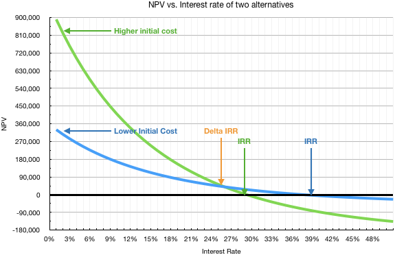

- toc
{:toc}

# Incremental Analysis

When comparing alternatives, use **incremental rate of return** ($$\Delta$$IRR) on the difference between alternatives for rate of return analysis. It is a technique ot detemine the true cost difference between alternatives.

## Analysis

**1. Determine alternative with higher initial cost**

Cash flow for the initial *difference* of alternatives is obtained by taking the higher **initial cost** alternative *minus* the lower initial cost of the other alternative.

**2. Evaluate cash flow difference for all periods**

Evaluate the difference of the net cashflow for each period. This will be used to to find present worth.

**3. Solve for effective interest rate such that NPW of the incremental difference is 0**

Recall that in IRR analysis, the IRR is when NPV is 0. Here we want to find the net present worth of cash flow from all periods and equate it to 0 to solve for $$\Delta$$IRR.

**4. Choose the alternative based on $$\Delta$$IRR**

Since we arbitrarily picked to take the alternative of higher initial costs minus the alternative iwht lower initial costs for the difference, then:

- If $$\Delta$$IRR (the effective interest rate such that NPW of differences =0) is **higher** than MARR, then go with the **alternative with higher initial cost**.
- If $$\Delta$$IRR is **lower** than MARR, go with the **alternative with lower initial cost**.

> **Example:** WIP

### Other Approach

One can plot the alternative's *NPV vs. interest rate* graph together. It immediately becomes apparent.

Of course, one could also use equivalent uniform annnual costs (EUAC) and equivalent uniform annual benefits (EUAB) instead of NPV.

## Multiple Alternatives

For multiple alternatives, we are still doing the same two-alternative incremental IRR analysis. Except it's a "battle royale" such that only the best option remains. The process is:

1. Order all alternative from highest to lowest initial cost. If applicable (include the *do nothing* option).
2. Compute the IRR for the lowest cost option.
   1. If IRR < MARR, then eliminate this alternative from the pool and move on to the alternative with next lowest cost
   2. If IRR > MARR, then this alternative becomes the *defender*
   3. If IRR > MARR while there is a defender, this alternative becomes the *challenger*
3. Challenger and defender faces off: incremental IRR analysis is done on challanger-defender
   1. If $$\Delta$$IRR > MARR: challenger becomes the new defender
   2. If $$\Delta$$IRR < MARR: defender remains, challenger eliminated from the pool
4. Go to the next alternative and repeat *step 3* until **only one** alternative remains.
