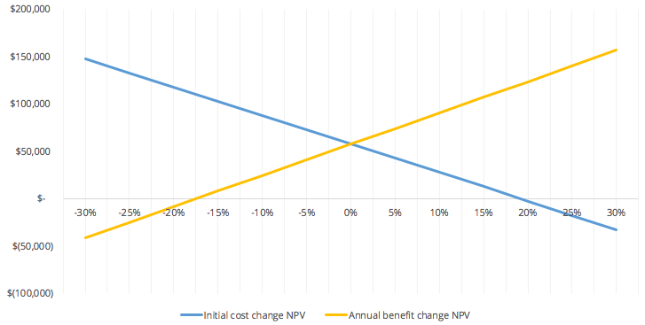

- toc
{:toc}

# Sensitivity Analysis

The projected and actual cash flow might not be the same could be attributed to various uncertain variables. Such as (but not limited to):

- Technological change
- Change in competition in the industry
- Macroeconomic change (inflation, unemployment, ecomoic growth, exchange rate)
- Tarrifs, trade wars, etc.

These will contribute to the inaccuracies of economic analysis.

**Sensitivity Analysis** is when we look at the change in output given some change in input. Similar to derivatives if you will ($$\frac{\Delta y}{\Delta x}$$). It is said to be **sensitive** if the output changes a lot with a small input.

The two types of sensitive analysises are *break-even analysis* and *what-if analysis*.

## Break-Even Analysis

*How much do we adjust our inputs such that our NPV or rate or return break-even*

**Break-even analysis** is typically represented as a break-even chart that indicates clearly where two alternatives equal to each other.

> **Example:** staged construction
>
> We have two options (assuming 8% interest rate):
>
> 1. Construct full-capacity building now for \$140k
> 2. Two stages: construct first stage now for \$100k and second stage at time $$n$$ for \$120k
>
> Notice that if we choose option 2 with $$n=0$$, then the present worth of cost is \$220k, not worth it compare to option 1.
>
> However if we change the input $$n$$ to a further date such that the cost discounted to present worth is less, then the present worth of cost of option 2 decreases:
>
> | $$n$$  | $$(P/F, 8\%, n)$$ | PW of cost |
> | ---- | --------------- | ---------- |
> | 5    | 0.6806          | \$182k     |
> | 10   | 0.4632          | \$156k     |
> | 15   | 0.3333          | \$140k     |
> | 20   | 0.2145          | \$126k     |
> | 30   | 0.0994          | \$112k     |
>
> We see that the option 2 breaks-even with option 1 if we decide to construct the second stage at $$n=15$$. Any $$n$$ beyond that, we should choose option 2 over option 1.
>
> Plotting $$n$$ on the x-axis, we can see break-even point graphically:
>
> 

## What-If Analysis

*What if the revenue decreases by 5%, or what if cost to X increases by 12%, etc. How will the output change.*

The **what-if analysis** shows how much a parameter must change to alter an economic decision and assess the inherent *risk* in a project. This is easily done in a spreadsheet by altering the variables.

> **Example**:
>
> Suppose the following *base case*: initial cost \$300k, annual benefit \$85k, salvage value \$60k, lifetime of 6 years, and MARR of 14%.
>
> > The **base case** uses the standard, unmodified numbers for cost, benefits, lifetime, interest, etc.
>
> Then we can set a few scenarios and setup a matrix where each base case property is increased or decreased by some percentage (in particular, -30%, -15%, +15%, and +30%). The modified values are in the table below.
>
> |                  | -30%     | -15%     | 0% (base case) | 15%      | 30%      |
> | ---------------- | -------- | -------- | -------------- | -------- | -------- |
> | *Initial cost*   | $210,000 | $255,000 | $300,000       | $345,000 | $390,000 |
> | *Annual benefit* | $59,500  | $72,250  | $85,000        | $97,750  | $110,500 |
> | *Salvage value*  | $42,000  | $51,000  | $60,000        | $69,000  | $78,000  |
> | *Lifetime*       | 4.20     | 5.10     | 6.00           | 6.90     | 7.80     |
> | *Interest*       | 10%      | 12%      | 14%            | 16%      | 18%      |
>
> Then we can comptue the NPV for each of the modified parameters. Note that each NPV is assuming **only one** parameter is changing at a time.
>
> |                  | -30%      | -15%     | 0% (base case) | 15%      | 30%       |
> | ---------------- | --------- | -------- | -------------- | -------- | --------- |
> | *Initial cost*   | $147,872  | $102,872 | $57,872        | $12,872  | $(32,128) |
> | *Annual benefit* | $(41,289) | $8,291   | $57,872        | $107,452 | $157,033  |
> | *Salvage value*  | $49,671   | $53,772  | $57,872        | $61,972  | $ 66,072  |
> | *Lifetime*       | $(8,431)  | $26,673  | $57,872        | $85,600  | $110,244  |
> | *Interest*       | $106,617  | $81,023  | $57,872        | $36,874  | $17,779   |
>
> We can notice how sensitive the NPV was to which input once we found the difference and color code the change.
>
> 
>
> We see that **initial cost** and **annual benefit** changes the output the most, therefore they're the most sensitive variables.
>
> ---
>
> We can also do a break-even analysis for the two sensitive variables, initial cost and annual benefit, to see at which point the output, NPV is \$0.
>
> 
>
> For **initial cost**, the break even point is at approximately <mark>+20%</mark> of the base case. For **annual benefit**, the break even point is at approximately <mark>-17.5%</mark> of the base case.

