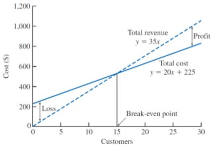
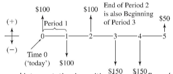

- toc
{:toc}

# Lesson 3: Cost and Revenues

## Types of Costs and Revenues

The cost is the economic value of the resources used to produce goods and services.

### Fixed

**Fixed cost** is the constant / unchanging cost which is mostly independent from how much goods or services is being produces.

> Note: even though the fixed cost is unchanging, it might be subject to periodic charges such as monthly rent or annual fees, etc.
>
> The *fixed* part implies that increasing production doesn't increase the fixed cost (i.e. money used to purchase a warehouse).

**Fixed revenues** are similar to fixed costs, except instead of expense, it is income.

### Variable

**Variable cost** depends on the level of output or production. This can include the labor and materials used to produce goods and services.

The total cost is fixed cost + variable cost.

**Variable revenue** is the income as a function of output or production. The more goods sold may result in greater revenue.

### Marginal

**Marginal cost** is the variable cost it takes to produce one more unit.

**Marginal revenue** is the revenue received from producing one more unit.

### Average

**Average cost** is the total cost divided by the number of units produced.

**Average revenue** is the total revenue divided by the number of units produced.

---

**Profit**: total revenue > total costs

**Loss**: total revenue < total costs

**Breakeven**: total revenue = total costs

---

### Sunk

**Sunk costs** are resources that is already expensed and has no means of recovery. Sunk cost should not affect future economic decisions.

### Opportunity

Opportunity cost is the expense of resources that could've been saved if one did alternative task instead. What is given up in order to do one task.

### Recurring & Non-Recurring

**Recurring cost** reoccurs at regular intervals (i.e rent, mortgage, etc.)

**Non-recurring cost** reoccurs at irregular intervals (i.e. paying for damages due to unpredicted accidents, Act of God, etc.)

> Buying *insurance* reduces non-recurring cost, but increases recurring cost.

### Incremental

The cost difference between alternative solutions or alternative parameters for solutions (i.e. buying iPhone X vs. buying the cheaper OnePlus 6).

### Cash & Book

**Cash cost** requires the transaction of dollars (from one party to another - i.e. paying for a burger or receiving money from selling illegal drugs).

**Book cost** are "cost effects" from historical decisions recorded in accounting books (i.e. asset deprecation). Engineering economic analysis usually ignore this.

### Life-Cycle

Life-cycle costs associates with products and goods' design costs over the period of their lifetime.

1. Design changes in later in life-cycle have higher cost. It is important to ensure good design decisions early on as it's very easy to change the design.
2. Decision made early in life-cycle tends to "lock-in" costs that will be incurred later.

## Cost Estimates

It is vital to make good and careful estimates to ensure an analysis is "a reasonable evaluation of future events".

### Types

**Rough estimates** gets within *order-of-magnitude* accurate within -30% to +60% because things tends to go wrong more. Used during early stages and high-level planning. The intent of rough estimation is to:

- determine project feasibility.
- quantify and consider the order of magnitude of numbers involved.

**Semidetailed estimates** are sued for budgeting purposes during *conceptual / preliminary* design stages. Here is when we need to examine components of the estimates in more detail, which requires additional time and resources. This is accurate within -15% to +20%.

**Detailed estimates** are used in later design stages such as *detailed design* and *contract bidding*. This estimate uses detaield quantitative models, datasheets, vendor quotes, etc. The estimates takes the most time and resources, but its evaluation is the most accurate. Usually from -3% to 5%.

### Difficulties

Estimation is difficult because it requires insight into future outcomes where economic consequences may be volatile.

**One-of-a-kind** or **first-run** estimates is difficult as it is the first time the project / task is being carried out. there is no historical data to examine. Costs and revenue of stages and components of the project may be unknown or unpredictable.

**Estimation by analogy** enables using knowledge about related, well-understood activities to anticipate economic parameters of new activities.

How well an engineering estimate can be carried out depends on the **available time and effort**. When the details in a estimate is critical, the estimate might be labor intensive and expensive. Thus would need to be anticipated.

**Estimator expertise** contribute partly as knowledge and intuition of the industry and its history can benefit in understanding and predicting future economic behavior. Obviously, not knowing the industry puts one in a disadvantage to make economic decisions.

## Estimation Models

### Per-Unit Model

*i.e. cost per unit square meter, cost per unit sold, etc.*

This estimate is useful for rough estimates, commonly used in construction industry. This model **does not** account for *economies of scale*.

### Segmenting Model

The overall estimate is decomposed into its individual components, where estimates are made at at much more detailed levels. Then the estimates are aggregated back together.

This is used where high-accuracy is needed.

> **Example**: BioWare's expense to attend E3
>
> The total cost may be segmented into costs to travel, marketing, merchandise, preparation, and venues.

> **Example**: Build a 2-DOF laser light show
>
> The cost for building might be divided down to: component costs, and programming costs. For which it could further divided into motor, commutator, laser, chassis for mechanical components; microcontroller, current driver, sensors for electrical components.

### Cost Indexes

*Cost indexes are numerical values that reflect historical change in costs.* They are used to estimate costs in current time. They are dimensionless; only indicate relative changes. The cost index is given by formula:

$$
\frac{\text{Cost at }t_1}{\text{Cost at }t_2}=\frac{\text{Index value at }t_1}{\text{Index value at }t_2}
$$

This accounts for time only and not scaling. For scaling, we need [power-sizing model](#power-sizing-model).

> **Example**:
>
> The cost index value of A is 100 ten years ago, and is 200 today. The cost of A is $100.
>
> Then the estimated cost of A today is given by:
>
> $$
> \begin{align}
> \text{Cost of A at }t_1&=\text{Cost of A at }t_2\times\frac{\text{Index value at }t_1}{\text{Index value at }t_2}\\
> &=\$100\times\frac{200}{100}\\
> &=\$200
> \end{align}
> $$
>

### Power-Sizing Model

It is unlikely that doubling the facilities exactly doubles the production. The model uses exponent to reflect and fit to *economics of scale*.

$$
\frac{\text{Cost of A}}{\text{Cost of B}}=\left(\frac{\text{Size (capacity) of A}}{\text{Size (capacity) of B}}\right)^x
$$

The $$x$$ here is the **power-sizing exponent**. We get diseconomies of scale if $$x \gt 1$$.

We also assume cost of A and B are taken from the same point in time. This means that it accounts for scaling only, and not time. For time, we need [cost indexes](#cost-indexes).

:ballot_box_with_check: Combining power-sizing model with cost indexes allows us to estimate involving both time and scale variances.

### Triangulation

Triangulation is a method in cost estimating that involves different sources of data and quantitative models to gain different perspectives.

### Improvement and Learning Curve

As repetition of a particular task increases, the productivity increases (increased performance). The **learning curve** shows the relationship between task performance and task repetition.

**Learning curve percentage** or **learning curve rate** is a fixed percentage of improved unit production time.

$$
T_N=T_0 \times N^b
$$

Where $$T_N$$ is the time required for  Nth unit of production, $$T_0$$ is the time required for initial unit of production, and $$b$$ is the learning curve exponent.

The relation between learning curve percentage and learning curve exponent is given as:

$$
\text{LC exponent}=\frac{\log(\text{LC percentage})}{\log2.0}, \qquad \text{LC percentage}=2^{\text{LC exponent}}
$$

Steady state is the area in which any more repetition will not increase performance noticeable. (Similar to differential equations in circuits and time constants).

## Cash Flow Diagrams

**Cash flow diagrams** (CFD) visualize cost and benefits over time. Cash flow are usually assumed to occur at time 0 or at the end of each period / entry. Each entry consists of timing of cash flow and net size of the cash flow.

Cash flow can be in several categories:

|                                 |                                                              |
| ------------------------------- | ------------------------------------------------------------ |
| First Cost                      | Expense to build, buy, or install                            |
| Operating and maintenance (O&M) | Annual expense such as electricity, labor, repairs, etc.     |
| Salvage value                   | Receipt at project termination for sale or transfer of the equipment |
| Revenues                        | Annual receipts due to sale of goods or services             |
| Overhaul                        | Major capital expenditure that occurs during asset's life time |

