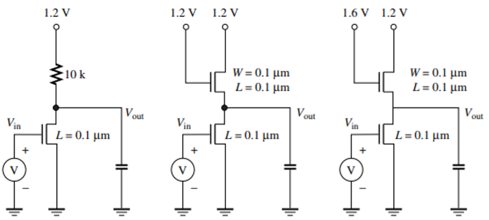
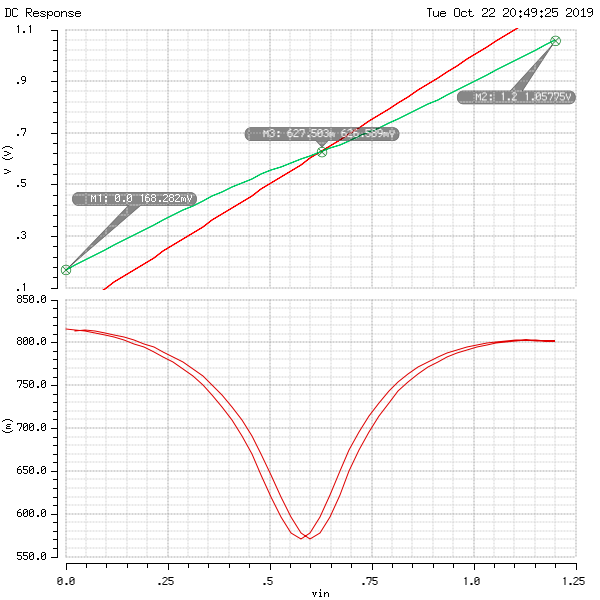
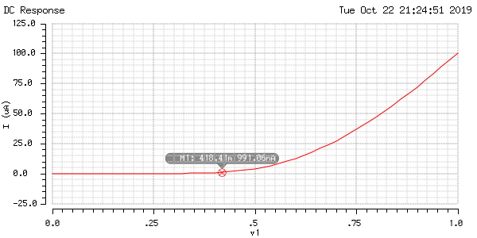
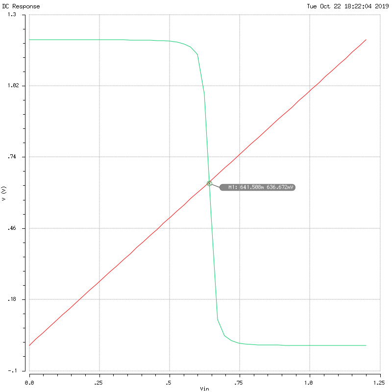
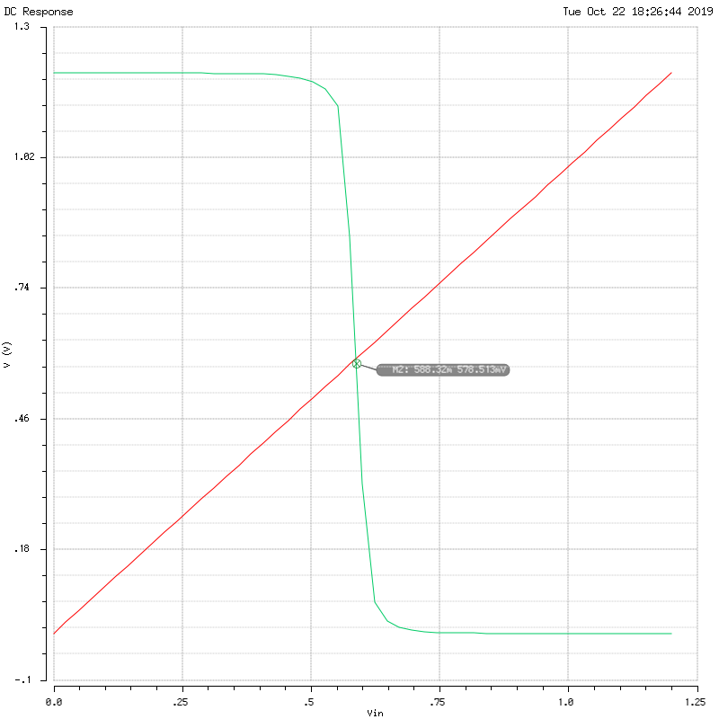
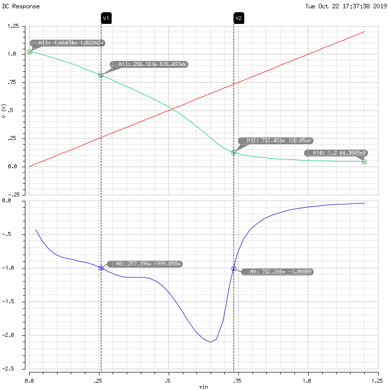

- toc
{:toc}

## 1. Transistor Size

*In the circuit of Figure below, design the widths of the pull-down transistors so that VOL=0.1 V. (All transistors are minimum size, L = 0.1 &mu;m. Explain the results.*

Since the diagrams don’t show how the transistor bulk are connected/biased, we can assume that there is no body-bias; and VT = VT0 = 0.4 V.

### Resistive-Load Inverter

We first take a look at the extreme ends of operation. When Vin is high, VOH is VDD because the MOS is in cut-off. Thus no current flows through the resistor and the voltage drop across the resistor is 0.

Since our parameter of interest is VOL and these are inverters, we are interested when the input voltage is HIGH. 

The resistive load transistor operates in the **linear** region. So we equate the current in the resistor to the current through the NMOS (IDS):

$$
\frac{V_{DD}-V_{OL}}{R_L}=\frac{W}{L}\left(\frac{\mu_n C_{ox}}{1+\frac{V_{DS}}{E_c L}}\right)\left(V_{GS}-V_T-\frac{V_{DS}}{2}\right)V_{DS}
$$

We substitute:

- VGS is Vin which is also VDD.
- VDS is Vout which is also VOL if the input voltage Vin is VDD.
- VDD is 1.2 V.
- VOL is 0.1 V.
- RL is 10 k&Omega;.
- L is 0.1 &mu;m.
- &mu;n is the mobility: 270 cm2V-1s-1.
- Cox is the oxide capacitance: 1.6&times;10-6 F/cm2.
- EC is the critical field: 6 V/&mu;m.
- VT is 0.4 V.

Isolate and solving for W:

$$
W=\frac{L\times\frac{V_{DD}-V_{OL}}{R_L}}{\left(\frac{\mu_n C_{ox}}{1+\frac{V_{DS}}{E_c L}}\right)\left(V_{GS}-V_T-\frac{V_{DS}}{2}\right)V_{DS}}
$$

Note that the centimeter (cm) cancels out when we multiply &mu;n and Cox. So we do the rest of the calculations with &mu;m as the unit for length.

$$
\begin{aligned}
W&=\frac{0.1\times\frac{1.2-0.1}{10\times 10^3}}{\left(\frac{270\times 1.6\times 10^{-6}}{1+\frac{0.1}{(0.6)(0.1)}}\right)\left(1.2-0.4-\frac{0.1}{2}\right)0.1}
\\
&=\frac{(0.1)(1.1\times10^{-4})}{(270\times1.6\times 10^{-6})(6/7)(0.075)}
\\
&=0.396~\mathrm{\mu m}
\end{aligned}
$$

The width of the NMOS transistor for the resistive-load inverter is **0.4 &mu;m**.

### Saturated-Enhancement-Load Inverter

Let’s denote the top transistor as *L* for *load*, and the bottom transistor as *I* for *inverting*. The top NMOS gate voltage is tied with VDD, so it is always operating in saturation. The bottom transistor is still operating in linear mode.

Again, we start by equating the current of the top transistor with the bottom transistor: IDSL = I DSI.

$$
\frac{W_I}{L_I}\cdot \frac{\mu_n C_{ox}}{1+\frac{V_{DS_I}}{E_C L_I}}\cdot\left(V_{GS_I}-V_T-\frac{V_{DS_I}}{2}\right)V_{DS_I}
=
W_L v_{sat}C_{ox}\cdot\frac{(V_{GS_L}-V_T)^2}{(V_{GS_L}-V_T)E_CL_L}
$$

Where we substitute:

- VGSI is just Vin.
- VDSI is Vout.
- VT is 0.4 V since we’re not assuming any body-bias effects.
- VGSL is VDD - Vout.

Isolate for WI:
$$
W_I=\frac{L_IW_L v_{sat}C_{ox}\cdot\frac{(V_{GS_L}-V_T)^2}{(V_{GS_L}-V_T)E_CL_L}}{\frac{\mu_n C_{ox}}{1+\frac{V_{DS_I}}{E_C L_I}}\cdot\left(V_{GS_I}-V_T-\frac{V_{DS_I}}{2}\right)V_{DS_I}}\times 10^{-4}
$$

Also note that in order to use vsat = 8&times;106 cm/s, we need to convert this to &mu;m/s, so we multiply the RHS of the equation by 1&times;10-4.

$$
W_I=\frac{(0.1)(0.1) (8\times 10^6)\cdot\frac{(1.2-0.1-0.4)^2}{(1.2-0.1-0.4)(6)(0.1)}}{\frac{(270) }{1+\frac{0.1}{(6)(0.1)}}\cdot\left(1.2-0.4-\frac{0.1}{2}\right)0.1}\times 10^{-4}\\
W_I=0.17~\mathrm{\mu m}
$$

### Less-Saturated-Enhancement-Load Inverter

In this case the gate voltage for the load transistor is 0.4 V higher than VDD so the maximum output can be VDD. But because the gate voltage is also higher, the top transistor is less-saturated.

Using the exact same equation as above, we use 1.6 - Vout instead for VGSL. But Vin (for the bottom NMOS) remains at VDD of 1.2 V.

$$
W_I=\frac{(0.1)(0.1) (8\times 10 ^6)\cdot\frac{(1.6 - 0.1-0.4)^2}{(1.6 - 0.1-0.4)(6)(0.1)}}{\frac{270}{1+\frac{0.1}{(6)(0.1)}}\cdot\left(1.2-0.4-\frac{0.1}{2}\right)0.1}\times 10^{-4}\\
W_I=0.328~\mathrm{\mu m}
$$

### Comments

The resistive-load inverter is able to have a output voltage all the way up to VDD which is good. But the resistor is cumbersome in digital design, and often means slower and bigger circuit. The size of the transistor thus is also relatively large at **0.4 &mu;m**.

Using the saturated-enhancement-load inverter, we no longer need the resistor. However, the maximum output voltage (high) is limited to VDD - VT. The trade-off is compensated with the small transistor size: at only **0.2 &mu;m**.

Lastly, we bias the gate voltage of the load NMOS exactly VT higher to obtain a maximum high output voltage of VDD. But the result is we use a substantially larger transistor: at **0.3 &mu;m**.

## 2. Buffer

The design presented in the diagram is a **buffer** or voltage follower or something like the *Redstone repeater* from *Minecraft*. 

Output swing: because the PMOS is the pull-down device, VOL is at least VTP, the threshold voltage from the PMOS. Similarly, because the NMOS is used as a pull-up device, VOH is at most VDD - VTN.

### DC Voltage Transfer Characteristics

- Starting from Vin of 0.0 V and slowly increasing it to VT. The output won’t budget because the PMOS remains on while the NMOS remains off. 
- After Vin = VTn + VTP, the driving NMOS turns on and start to pull output up. The output voltage will keep increasing as we increase the input voltage, all the way to VDD. By then, the output voltage is capped at VDD - VTN. VDD - VTP is where the PMOS fully turns off, which is close to where VOH is.
- Now let’s go from input high to input low. The output won’t budge until Vin drops to VDD - VTP. because the pull-down PMOS is off.
- At Vin = VDD - VTP - VTN and below, the PMOS gets stronger and pulls the output voltage back down to VTP.

Notice that positive edge characteristics is different from negative edge, therefore we have hysteresis. It looks like this:

### Gain

Theoretically, the gain should be close to 1 as output voltage follows input voltage. However, this is not a valid gate because it fails the following requirements:

- :x: High gain region is not between low gain regions.
- :x: Gain is higher than 1 for high gain region.
- :x: Low output is not below VIL.
- :x: High output is not above VIL.

In additional to lack of noise-rejection, this design also lack regenerative properties.

### CAD

Below is the schematic. Since the bulk connection is not specified from the diagram. The bulk of the NMOS is connected to ground, and the bulk of the PMOS is connected to VDD.

Running the DC sweep on Vin from 0V to 1.2V (VDD) gets us the follow VTC plot. I also took the derivative of the green curve (VTC curve) so we can see that there exists hysteresis more clearly. The plot is a bit different from what I expected.

## 3. Body Effect Factor

First model on CAD:

To take multiple samples, I fix V2 to some value (0V, 0.2V, 0.4V, etc.). And then perform a DC sweep for V1 from 0 V to 1.2 V. For each trial, VT is where the current IDS begin to rise: see below sample calculation and plot. I’m using 1 &mu;A as a threshold to determine the VT.

Here’s a table of data for VT using different V2 values:

| V2 [V] | VT [V] |
| ----------------- | ----------------- |
| 0.0               | 0.419             |
| 0.2               | 0.645             |
| 0.4               | 0.870             |
| 0.6               | 1.092             |
| 0.8               | 1.313             |

Using the data collected above, we can compute for the body-effect coefficient $\gamma$:

$$
V_T = V_{T_0}+\gamma(\sqrt{V_{SB}+\vert2\phi_F\vert}-\sqrt{\vert2\phi_F\vert})
$$

Where VT0 is 0.4 V, VSB is just V2, and 2&phi;F is 0.88V.

VT0 is when the second term is zero. Since $\gamma$ and $2\phi_F$ is non-zero, the only case is when VSB is 0. Which gives us **VT0=0.419 V**.

I used *Excel* to compute the other data where VSB=V2 is not zero and using the formula:

$$
\gamma=\frac{V_T-V_{T_0}}{\sqrt{V_{SB}+\vert 2\phi_F\vert}-\sqrt{\vert 2\phi_F\vert}}
$$

| V2 [V] | VT [V] | Body-Effect Coefficient [V&frac12;] |
| ----------------- | ----------------- | ---------------------------------------------- |
| 0.2               | 0.645             | 0.12                                           |
| 0.4               | 0.870             | 0.23                                           |
| 0.6               | 1.092             | 0.32                                           |
| 0.8               | 1.313             | 0.41                                           |

The **body-efficient coefficient** $\gamma$ varies with the voltage across source and bulk and it ranges between **0.12 and 0.41**.

## 4. MOS Capacitances

*Consider the layout in the figure below implemented in a 180nm technology. Assume that the transistor has W=900nm, L=180m, and a source/drain dimension Y=800nm and a lateral diffusion of 22nm. Let tox = 40 Å.*

### Gate and Overlap Capacitances

*Compute the worst case gate capacitance per unit width, Cg in units of fF/&mu;m. Estimate CGS, CGD and CGB in linear, saturation, and cutoff, including overlap effects.*

Let’s first find the oxide capacitance, which is a function of the thickness of the oxide layer.

$$
C_{ox}=\frac{\epsilon_{ox}}{t_{ox}}
$$

Where $\epsilon_{ox}$ is the silicon dioxide relative permissibility multiplied by the permissibility of free-space: $3.9\epsilon_0$. And the thickness $t_{ox}$ is  40 angstroms, or 40&times;10-10 m.

Plugging in the values, we get values $C_{ox}=8.63$ F/&mu;m2.

Then the gate capacitance is simply multiplication by the length L:

$$
C_g=C_{ox}L=(8.63)(0.18)=1.55~\mathrm{fF/\mu m}
$$

Since the thickness of the gate, Tpoly is not given, we assume that the fringe capacitance is negligible (Cf = 0).

The overlap capacitance for each overlap is given by the oxide capacitance multiplied by how much is overlapped (lateral diffusion LD=22 nm).

$$
C_{ol}=C_{ox}L_D=(8.63)(0.022)=0.19~\mathrm{fF/\mu m}
$$

---

The total gate capacitance (which need us to multiply the numbers we got earlier with the width W) is

$$
C_G=C_g W=(1.55)(0.9)=1.4~\mathrm{fF}
$$

The total overlap capacitance for each overlap is

$$
C_{OL}=C_{ol}W=(0.19)(0.9)=0.17~\mathrm{fF}
$$

---

The capacitances broken down into the three parts: gate-source, gate-drain, and gate-bulk is as follows:

|                    |         Cutoff | [fF] |                           Saturation | [fF] |                               Linear | [fF] |
| ------------------ | -------------: | ---- | -----------------------------------: | ---- | -----------------------------------: | ---- |
| **VGS** | COL | 0.17 | &frac23;CG+COL | 1.10 | &frac12;CG+COL | 0.87 |
| **VGD** | COL | 0.17 |                       COL | 0.17 | &frac12;CG+COL | 0.87 |
| **VGB** |  CG | 1.40 |                                    - | 0.00 |                                    - | 0.00 |

### Junction Capacitance

First, we calculate the voltage asymptote: &phi;B.

$$
\begin{aligned}
\phi_B&=\frac{kT}{q}\ln\left\vert\frac{N_AN_D}{n_i^2}\right\vert\\
&=2.565\times 10^{-2}\ln\left\vert\frac{(3\times 10^{16})(3\times 10^{19})}{(1.45\times 10^{10})^2}\right\vert\\
&=0.93~\text V
\end{aligned}
$$

Next, the zero-bias junction capacitance, where &epsilon;si is the pure silicon permissibility at 11.7&epsilon;0:

$$
\begin{aligned}
C_{j_0}&=\sqrt{\frac{\epsilon_{si} q}{2\phi_B}\cdot\frac{N_AN_B}{N_A+N_B}}\\
&=5.17\times10^{-8}~\text{F/cm}^2\\
&=0.517~\mathrm{fF/\mu m^2}
\end{aligned}
$$

Lastly, to get Cj, we multiply the per-area capacitance with the area: which is the bottom plate and the side walls.

$$
\begin{aligned}
C_j&=C_{j_0}(Y+2x_j)\\
&=C_{j_0}(0.8+2(0.3))\\
&=0.72~\mathrm{fF/\mu m}
\end{aligned}
$$

### Drain Junction Capacitance

To calculate the junction capacitance, the formula is

$$
C_J=\frac{C_{j}W}{\left(1-\frac{V_J}{\phi_B}\right)^m}
$$

Where A is the area, VJ is the voltage across the junction, and m is &frac12;. 

When VD is 1.8V the voltage across the junction is the voltage of the bulk subtract the drain voltage:

$$
V_J = V_B-V_D=-1.8~\mathrm V
$$

Plugging in, we get

$$
C_J=\frac{(0.72)(0.9)}{\left(1-\frac{-1.8}{0.93}\right)}=0.222~\mathrm{fF}
$$

When VD is 0, the junction voltage is 0. So junction capacitance is simply

$$
C_J=C_jW=(0.72)(0.9)=0.651~\mathrm{fF}
$$

## 5. NOR Gate

*Calculate Vs of 2-input NOR gates when one input is switching and with both inputs tied together. The device sizes are WP = 24λ and WN = 6λ. Use Cadence to find results when switching only input A, AB together. Results for two inputs switched separately vary slightly. Explain the discrepancy between theory and simulation.*

First, I modelled the NOR gate in CAD. Note that I left the width property of the PMOS and NMOS as variable `WP` and `WN`. Here, we are using &lambda; = 100nm.

### Only Switching Input A

Next, I created the test-bench for just switching input A:

I setup the DC sweep analysis for *Vin* from 0V to 1.2V (VDD). Here is the voltage transfer characteristics (VTC):

The switching voltage **VS = 0.642V**.

### Tied Inputs A  & B

Now I modify the test-bench such that the input A and B are tied up together:

And here is the corresponding VTC plot:

Now the switching voltage **VS = 0.588V** has shifted to the left.

### Theory

“How much stronger the NMOS is to the PMOS” can be described by the factor $\chi$:

$$
\chi=\sqrt{\frac{W_N}{E_{CN}L_{N}}\frac{E_{CP}L_P}{W_P}}
$$

And the switching voltage is given by:

$$
V_s=\frac{V_{DD}-\vert V_{TP}\vert + \chi V_{TN}}{1+\chi}
$$

So let’s find the threshold voltage first. Since the bulk of the PMOS are connected to VDD and the bulk of the NMOS are connected to ground, VSB = 0 for both, and therefore VT is 0.4V.

The two extreme cases are: if only one input is switching, and if all inputs are tied as one. Any behavior of the gate (in terms of the VTC) is bracketed between these two cases.

**Case 1: only A is switching**:

As per standard CMOS design, for a NOR gate, the PMOS would be 4 times larger than the NMOS. However, because the MOS connected to B never switches and is grounded — the B-PMOS is a short, and B-NMOS is an open circuit.

The resulting (simplified) circuit is a single-input inverter:

> Note that in the diagram, I used “W” to show relative size of the NMOS and PMOS. To fit the problem description, W is equivalent to 6&lambda;.

Compared to a standard inverter where the PMOS is suppose to have the double the width that of NMOS, we have 4 times the width. Meaning that the pull-up PMOS is much “stronger”. In other words, $\chi$ is smaller. Thus, we expect the VTC to shift to the right &rarr;.

Switching voltage:

$$
\chi=\sqrt{\frac{W}{6}\frac{24}{4W}}=1\\
V_s=\frac{(1.2)-\vert -0.4\vert + (1)(0.4)}{1+1}=\frac{1.2}{2}=0.6~\text V
$$

**Case 2: all inputs tied:**

Shorting all the inputs together and using the same simplification used for case 1, we get the following equivalent single-input inverter (adding resistances: 4W and 4W in series makes 2W; W and W in parallel makes 2W):

Now compared to the standard inverter, NMOS is now much stronger than PMOS (since it should’ve been half the size).  So $\chi$ is larger, and we expect the VTC to shift to the left.

Switching voltage:

$$
\chi=\sqrt{\frac{2W}{6}\frac{24}{2W}}=\sqrt{4}=2\\
V_s=\frac{(1.2)-\vert -0.4\vert + (2)(0.4)}{1+2}=\frac{1.6}{3}=0.53~\text V
$$

### Discrepancy

The calculated switching voltages are smaller compared to the voltage measured from the simulation. I suspect it’s because there exists unaccounted body-effect. This could change the threshold voltage VT and thus change the switching voltage Vs. VT of 0.56 V would gives us closer number to the one obtained from simulation.

## 6. Inverter Noise Margin

*Using the following schematic and Cadence simulations find NMH and NML*.

**Note:** for this problem, because the CAD library doesn’t allow sizes less than 120nm, we will use L=100nm for both NMOS, W=120nm for top NMOS, and W=1 &mu;m for bottom NMOS.

Here is the schematic of the the saturated-enhanced inverter cell view:

Here is the VTC plot of this circuit, DC sweeping the signal `INPUT` from 0.0V to VDD (1.2V). The green curve is the `OUTPUT` signal.

To find the noise margin, we must first find VIL, and VHH which corresponds to the positions on the green curve where the slope is -1. We can find the slope by taking the derivative of the graph (in blue).

Where the slope equals to -1 is where input voltage is 0.257V and 0.733V for low and high, respectively. Thus, **VIL = 0.257V** and **VIH = 0.732V**.

Next, by inspecting from the graph, the output low and high voltage are: **VOL = 0.044V** and **VOH = 1.023V**.

Finally, we have all the values to compute the noise margin:

$$
NM_L=V_{IL}-V_{OL}=0.257-0.044=0.213~\text V\\
NM_H=V_{OH}-V_{IH}=1.023-0.732=0.290~\text V
$$
