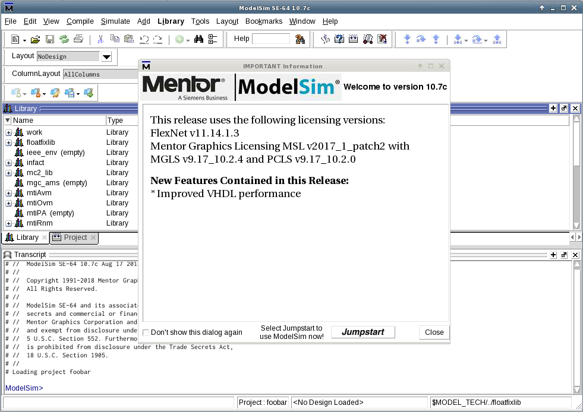

This document covers how to setup the Linux environment to use ModelSim, compiling and synthesizing SystemVerilog files, and configuring ModelSim to simulate a testbench.

- toc
{:toc}

## Tools Overview

Verilog (`.v` filetype) and SystemVerilog (`.sv` filetype) are hardware description landugage files we use to construct hardware and state-machines. SystemVerilog is like Verilog but newer. 

In this tutorial, I will work with *SystemVerilog*, but I will also refer to it as *Verilog* for the sake of convenience .

**ModelSim** is an IDE for writing, compiling, and simulating Verilog projects. To run Modelsim, use the following commands:

## Environment Setup

In this section, we will setup the Linux environment ready for the tools, take care of licensing issues, and start using the tools.

### Working Directory

We will create a working directory where our ModelSim project files and other generated files will live. One option is to make a `ModelSim_StudentNumber` directory in your home directory — where `StudentNumber` is your UBC student number or ECE account ID. Once you made the directory, descend into that directory:

```shell
mkdir ModelSim_StudentNumber
cd ModelSim_StudentNumber
```


### ModelSim

In our working directory, source the ModelSim *.csh* file to automatically set up the environment and licensing. After sourcing the file, we can launch ModelSim using the command `vsim`.

```shell
source /CMC/scripts/mentor.modelsim.10.3.csh
vsim -64 &
```

> ##### Note 
>
> - Use `-64` flag when running `vsim` to use 64-bit version of the ModelSim software.
> - Adding `&` starts the ModelSim process in the background so you can continue to use the terminal/command line.


Once ModelSim launches, we should see this screen (Figure 1):



<figcaption class="figure-caption”>Figure 1. ModelSim Initial Window</figcaption>


> ##### Optional Shortcut
>
> If you find typing out the command to be tedious every time you want to start ModelSim, you can assign an *alias* to run the same commands. Simply open your `.cshrc` file from your home directory and add the line:
>
> ```sh
> alias modelsim 'source /CMC/scripts/mentor.modelsim.10.3.csh && vsim -64 &'
> ```
>
> Then reset your shell environment by running:
>
> ```sh
> source ~/.cshrc
> ```
>
> Next time you want to run ModelSim, simply use the command:
>
> ```shell
> modelsim
> ```


## SystemVerilog Files

### Project

### Module Files

### Compilation

### Testbench Module Files

## Unsynthesized Simulation